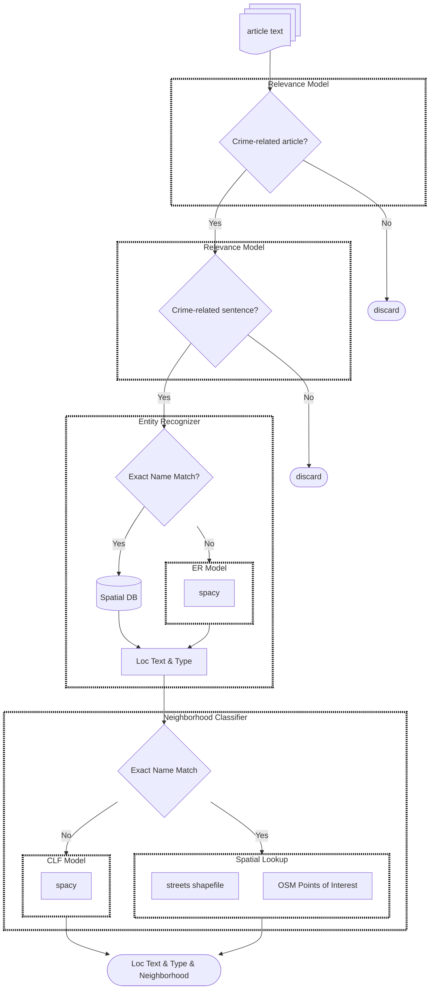

# Quantify Justice News

Geo-extracting crime locations mentioned in news articles.

# Installation

(So I don't forget ...)

1. Install pipx (for poetry): `brew install pipx`
2. Install poetry (for dependency mgmt): `pipx install poetry`
3. Configure poetry
- Set python version:
- `poetry env use python3` 
-  If it later complains about your python version, re-run this with e.g. `use python3.12`
-  Make poetry create a local venv instead of putting it in /Library/cache (seems optional but this might be what made vscode finally work):
- `poetry config virtualenvs.in-project true`
4. Let poetry pick its dependencies: `poetry add pkg1 pkg2 ...`
5. Add kernel to jupyter: `poetry run python -m ipykernel install --user --name=qjn --display-name "Python (qjn)"

# Pipeline

To run a dagster DAG:
> mkdir -p ./.dagster_home
> export DAGSTER_HOME=$(pwd)/.dagster_home
> poetry run dagster dev

To label data:
> poetry run label-studio

# Modules



<!-- # Project Structure

```
project/
├── data/
│   ├── raw/
│   │   ├── articles/
│   │   │   └── (input text files)
│   │   ├── shapefiles/
│   │   │   └── streets/
│   │   │       └── (streets shapefile files)
│   │   └── osm/
│   │       └── (OSM Points of Interest files)
│   ├── processed/
│   │   ├── spatial_db/
│   │   │   └── (spatial database files, e.g., GeoJSON, SQLite)
│   │   ├── er_model/
│   │   │   └── (saved spacy model files)
│   │   └── clf_model/
│   │       └── (saved spacy model files)
├── models/
│   ├── entity_recognizer/
│   │   ├── (saved ER model files)
│   └── neighborhood_classifier/
│       ├── (saved CLF model files)
├── scripts/
│   ├── entity_recognizer.py
│   ├── neighborhood_classifier.py
│   ├── spatial_db_builder.py
│   ├── data_processor.py
│   ├── main.py
├── notebooks/
│   ├── data_exploration.ipynb
│   ├── model_training_er.ipynb
│   ├── model_training_clf.ipynb
├── requirements.txt
├── README.md
```

# Project Structure Dagster

```
project/
├── data/
│   ├── raw/
│   │   ├── articles/
│   │   │   └── (input text files)
│   │   ├── shapefiles/
│   │   │   └── streets/
│   │   │       └── (streets shapefile files)
│   │   └── osm/
│   │       └── (OSM Points of Interest files)
│   ├── processed/
│   │   ├── spatial_db/
│   │   │   └── (spatial database files, e.g., GeoJSON, SQLite)
│   │   ├── er_model/
│   │   │   └── (saved spacy model files)
│   │   └── clf_model/
│   │       └── (saved spacy model files)
├── models/
│   ├── entity_recognizer/
│   │   ├── (saved ER model files)
│   └── neighborhood_classifier/
│       ├── (saved CLF model files)
├── pipelines/
│   ├── spatial_db_pipeline.py
│   ├── er_pipeline.py
│   ├── clf_pipeline.py
│   ├── full_pipeline.py
├── resources/
│   ├── spatial_db_resource.py
│   ├── er_model_resource.py
│   ├── clf_model_resource.py
│   ├── data_paths.py
├── scripts/
│   ├── entity_recognizer.py (may be refactored into Dagster ops)
│   ├── neighborhood_classifier.py (may be refactored into Dagster ops)
│   ├── spatial_db_builder.py (may be refactored into Dagster ops)
│   ├── data_processor.py (may be refactored into Dagster ops)
│   ├── main.py (Dagster CLI entry point)
├── notebooks/
│   ├── data_exploration.ipynb
│   ├── model_training_er.ipynb
│   ├── model_training_clf.ipynb
├── requirements.txt
├── pyproject.toml (for build/dependency management)
├── dagster.yaml (Dagster configuration)
├── README.md
```
 -->
